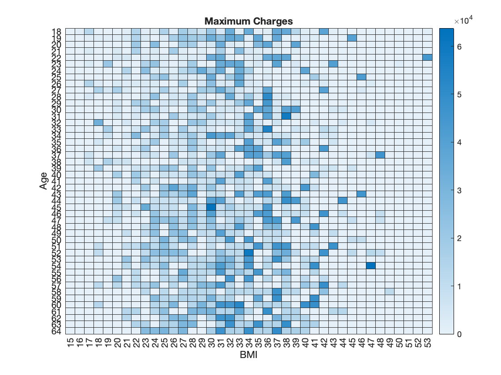

# ReadMe
The repository is dedicated to a course at Tsinghua University.
* Course Name: Artificial Intelligence of Things (AIoT)
* Course ID: 86010043
* Semester: Fall 2021

Most of the time spent on the assignment was to construct the machine learning script. It was also instructed to plot five different diagrams to find insights in the dataset. The below illustrates the correlation between the premium and one's age and BMI with heatmap.
## Snapshot

